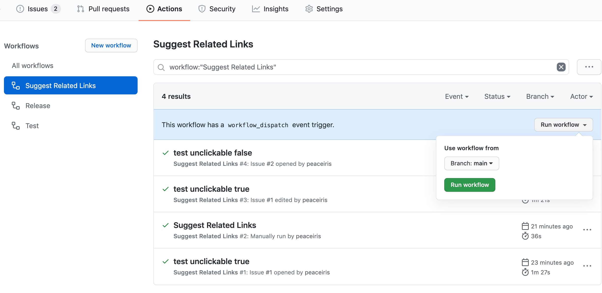

## Suggest Related Links Action

A GitHub Action to suggest related or similar issues, documents, and links. Based on the power of NLP and fastText.


## Table of Contents

<!-- START doctoc generated TOC please keep comment here to allow auto update -->
<!-- DON'T EDIT THIS SECTION, INSTEAD RE-RUN doctoc TO UPDATE -->


- [Getting Started](#getting-started)
  - [Create Workflow](#create-workflow)
  - [Save Issues Data](#save-issues-data)
  - [Create Issue](#create-issue)
- [Overview](#overview)
  - [Data Collection](#data-collection)
  - [Preprocessing](#preprocessing)
  - [Train Model](#train-model)
  - [Find Similar Issues](#find-similar-issues)
  - [Suggest Issues](#suggest-issues)
- [Maintainers](#maintainers)
- [License](#license)

<!-- END doctoc generated TOC please keep comment here to allow auto update -->


## Getting Started

### Create Workflow

Create your YAML workflow file as follows.

e.g. `.github/workflows/suggest-related-links.yml`

```yaml
name: 'Suggest Related Links'

on:
  issues:
    types:
      - opened
      - edited
  workflow_dispatch:
  schedule:
    - cron: '13 13 * * */7'

jobs:
  action:
    runs-on: ubuntu-18.04
    steps:
      - name: Setup Python
        if: github.event_name == 'issues'
        uses: actions/setup-python@v2.1.2
        with:
          python-version: '3.8'

      - name: Cache dependencies
        uses: actions/cache@v2
        with:
          path: ~/actions-suggest-related-links-tmp
          key: ${{ runner.os }}-action-${{ hashFiles('~/actions-suggest-related-links-tmp/training-data.json') }}
          restore-keys: |
            ${{ runner.os }}-action-

      - uses: peaceiris/actions-suggest-related-links@v1.0.0

      - name: Setup model
        if: github.event_name == 'issues'
        run: |
          cd ~
          git clone https://github.com/peaceiris/actions-suggest-related-links.git
          cd ./actions-suggest-related-links/models
          git checkout v1.0.0
          python3 -m pip install -r ./requirements.txt

      - name: fastText
        if: github.event_name == 'issues'
        run: |
          cd ~/actions-suggest-related-links/models/fasttext
          cp ~/actions-suggest-related-links-tmp/training-data.json .
          cp ~/actions-suggest-related-links-tmp/input.txt .
          python3 train.py -d training-data.json -test input.txt
          cp ./suggestions.json ~/actions-suggest-related-links-tmp/

      - uses: peaceiris/actions-suggest-related-links@v1.0.0
        with:
          mode: 'suggest'
```

### Save Issues Data

Run It manually only the first time to save issues data.
After the first running, it will be automatically executed following the setting of the `schedule.cron`.



### Create Issue

Some related links which are similar to the created issue body will be listed by this action.


<div align="right"><a href="#table-of-contents">Back to TOC ☝️</a></div>


## Overview

Our GitHub Action is **actions-suggest-related-links**,  which suggests related or similar issues, documents, and links.
This action mainly consists of 5 parts: Data Collection, Preprocessing, Train model, Find similar issues, and Suggest Issues.


### Data Collection

All issues of the repository are collected with the GitHub API.
The issues include the title, body, and comments.
Training Data is regularly collected using the scheduling function and output as an artifact and saved as a cache.

### Preprocessing

The Markdown format is converted to plain text with [unified].
At this time, symbols that are not alphabetic characters are deleted.

- https://github.com/peaceiris/actions-suggest-related-links/blob/main/actions/src/preprocess.ts

[unified]: https://unifiedjs.com/

### Train Model

When a new issue is created or updated, the fastText model is trained.
In accordance with its name, fastText has the advantage of very short inference times.

We think training time at the GitHub Actions runners won't be an issue.
In the case of [GitHub Actions for GitHub Pages] repository, the training execution time is 1 sec.
But installing time of dependencies takes 1 min, the total execution time is about 1.5 min.

[fastText]: https://fasttext.cc/
[GitHub Actions for GitHub Pages]: https://github.com/peaceiris/actions-gh-pages

### Find Similar Issues

Calculate word vectors of training data and word vectors of posted data in fastText.
The cosine similarity is used to determine which word vectors of training data is close to the word vectors of the posted data.
The higher the cosine similarity, the more similar the sentence.

### Suggest Issues


<div align="right"><a href="#table-of-contents">Back to TOC ☝️</a></div>


## Maintainers

- [peaceiris (Shohei Ueda)](https://github.com/peaceiris)
- [S-Kaisei (Kaisei Shimura)](https://github.com/S-Kaisei)


## License

- [MIT License | peaceiris/actions-suggest-related-links/LICENSE](https://github.com/peaceiris/actions-suggest-related-links/blob/main/LICENSE)

<div align="right"><a href="#table-of-contents">Back to TOC ☝️</a></div>
